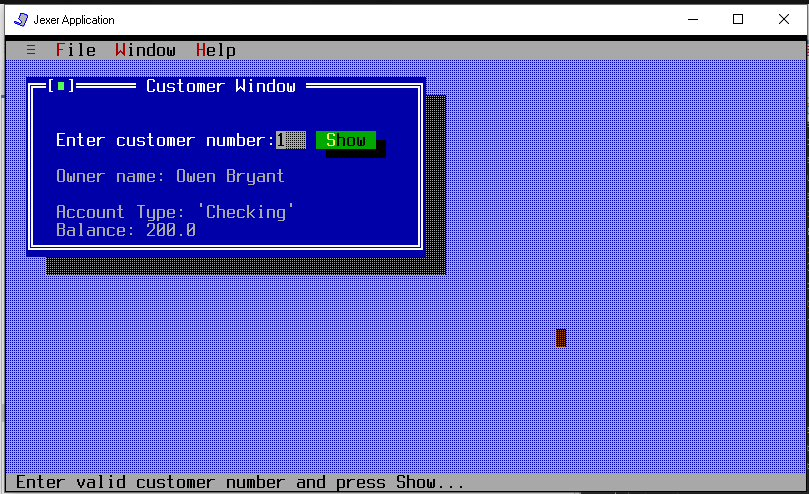

# UI Lab 1

Це одна з робіт, які доповнюють основний цикл лабораторних робіт #1-8 (проект **Banking**, [Netbeans](https://netbeans.org/)) з ООП.  Основна мета цих додаткових вправ - познайомитись з різними видами інтерфейсів користувача та засобами їх створення. Згадувані 'базові' роботи розміщено в [окремому репозиторії](https://github.com/liketaurus/OOP-JAVA) (якщо будете робити завдання на "4" або "5" раджу переглянути [діаграму класів](https://github.com/liketaurus/OOP-JAVA/blob/master/MyBank.png), аби розуміти які методи є у класів).

В ході першої роботи вам пропонується виконати **наступне завдання** - [Робота 1: TUI з Jexer](https://github.com/ppc-ntu-khpi/TUI-Lab1-Starter/blob/master/Lab%201%20-TUI/Lab%201.md)

## На "п'ять"
1. Перепишіть метод **ShowCustomerDetails** з використанням класів *Bank, Customer, Account* та ін. з наших попередніх лаб - інформація про клієнтів банку та їх рахунках має читатись з файлу **test.dat** (робота номер 8, [файл даних](https://github.com/liketaurus/TUI-Labs/blob/master/data/test.dat) також є в цьому ж репозиторію). Інформацію про клієнта (та про перший рахунок, що йому належить) ви маєте побачити, увівши номер клієнта.
2. Запустіть проект, впевніться, що все працює як очікувалось. Продемонстрируйте результат викладачеві.

## Результат
